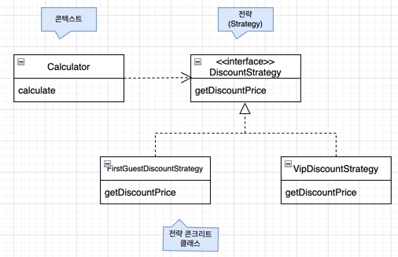

개발자가 반드시 정복해야 할 객체 지향과 디자인 패턴

전략(strategy) 패턴 (p.175 ~ 181)

과일 매장에 여러가지 할인 정책이 있다.(ex. 첫 손님 10% 할인, vip 15% 할인 등)
<br>이를 코드로 구현하는 방법 중 하나는 if-else를 사용하는 것이다.
```java
public class Calculator {
    
    public int calculate(boolean firstGuest, boolean vip, List<item> items) {
        if 첫번째손님이면, 10%할인
        else if vip손님이면, 15퍼 할인
    }
}
```
이는 두가지 문제점이 있다.
1. 서로 다른 정책들이 하나의 코드에 있어 정책이 늘어날수록 코드분석이 어려워짐
2. 정책이 늘어날수록 확장하기가 어려워짐. 정책에 따른 조건이 매개변수에 추가되어야 하고, if문도 추가되어야 함

### 전략패턴을 사용하면 위의 문제를 해결할 수 있다.



```java
public class Calculator {
    
    private DiscountStrategy discountStrategy;
    
    public Calculator(DiscountStrategy discountStrategy) {
        this.discountStrategy = discountStrategy;
    }
    
    public int calculate(List<Item> items) {
        int sum = 0;
        for (Item item) {
            sum += discountStrategy.getDiscountPrice(item);
        }
        return sum;
    }
}
```
