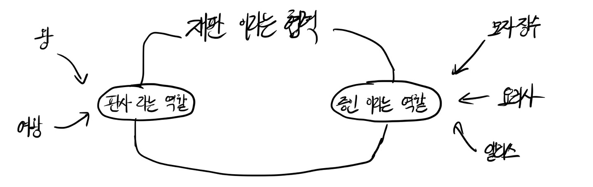

# 객체지향의 사실과 오해

4장 역할, 책임, 협력 (p106-137)

## 객체지향  - 역할, 책임, 협력의 관점에서
- 객체지향 개발에서 가장 중요한 능력은 **"책임을 능숙하게 소프트웨어 객체에 할당하는 것"**
- 객체지향 설계는 협력에 참여하기 위해 어떤 객체가 어떤 책임을 수행해야 하고, 어떤 객체로부터 메시지를 수신할 것인지를 결정하는 것으로부터 시작됨
 (어떤 클래스가 필용하고, 어떤 메서드를 포함해야 하는지를 결정하는 것은 이후에 해도됨)

## 협력
- 다수의 연쇄적인 "요청"과 "응답"의 흐름으로 구성

## 책임
- 어떤 대상에 대한 요청은, 그 대상이 요청을 처리할 책임이 있음을 암시함
 (ex. 판사에게 "재판을 수행하라"라는 요청을 보고, 판사는 "재판을 수행"할 책임이 있음을 알 수 있음)
- 객체지향 개발에서 가장 중요한 능력은 **"책임을 능숙하게 소프트웨어 객체에 할당하는 것"**

### 책임의 분류
- 객체의 책임은 **1. 하는 것(doing) 2. 아는 것(knowing)** 으로 분류할 수 있음
- 즉, 책임은 객체가 **"외부에 제공해 줄 수 있는 정보(아는 것의 측면)"** 와 **"외부에 제공해 줄 수 있는 서비스(하는 것의 측면)"** 의 목록
- 따라서 책임은 객체의 public interface를 구성

### 책임과 메시지
- 객체가 다른 객체에게 주어진 책임을 수행하도록 요청을 보내는 것을 메시지 전송이라고 함
- 객체 간의 협력은 메시지를 통해 이루어짐
- 메시지는 협력에 참여하는 두 객체 사이의 관계를 강조한 것

## 역할
- 어떤 객체가 수행하는 책임의 집합은 객체가 협력 안에서 수행하는 역할을 알시함

### 역할이 답이다

재판은 아래과 같은 절차로 이루어진다고 하자.
 
1. 누군가 "판사"에게 재판을 요청
2. "판사"가 재판을 엶
3. "판사"가 "증인"을 호출
4. "증인"이 재판에 등장
5. "판사"가 "증인"에게 증언을 요청
6. "증인"이 증언을 함

판사의 책임은 아래와 같다.
1. 재판을 엶
2. 증인을 호출
3. 증언을 요청

증인의 책임은 아래와 같다.
1. 재판에 등장
2. 증언을 함

이때, 판사와 증인의 역할은 위와 같은 책임의 집합을 수행할 수 있는 모든 객체가 맡을 수 있다.
 
판사의 책임을 수행할 수 있는 왕, 왕비가 판사라는 역할을 맡을 수 있고,
증인의 책임을 수행할 수 있는 모자장수, 요리사, 앨리사가 증인이라는 역할을 맡을 수 있는 것이다.

## 객체의 모양을 결정하는 협력

### 흔한 오류
1. 시스템에 필요한 데이터를 저장하기 위해 객체가 존재한다?
  -> 객체가 존재하는 이유는 행위를 수행하며 협력에 참여하기 위해서이다. 따라서 객체의 상태보다  행동(책임)이 중요하다.

2. 객체지향은 클래스와 클래스 간의 관계를 표현하는 시스템의 정적인 측면에 중점을 두고있다?
  -> 정적인 클래스보다 협력에 참여하는 동적인 객체가 더 중요하다. 객체지향의 핵심은 클래스를 어떻게 구현할 것인가가 아니라 객체가 협력 안에서 어떤 책임과 역할을 수행할 것인지를 결정하는 것이다.

### 협력을 따라 흐르는 객체의 책임
올바른 객체를 설계하는 방법
1.  먼저 견고하고 깔끔한 협력을 설계해야 함
  -> 설계에 참여하는 객체들이 주고받을 요청과 응답의 흐름을 결정한다는 것을 의미
2. 결정된 요청과 응답의 흐름은 객체가 협력에 참여하기 위해 수행될 책임이 됨
3. 객체에게 책임을 할당하고 나면 책임은 객체가 외부에 제공하게 될 행동이 됨
4. 행동을 결정한 후에 그 행동을 수행하는 데 필요한 데이터를 고민해야 함
5. 협력에 참여하기 위해 필요한 객체의 데이터와 행동이 어느 정도 결정된 후에 클래스의 구현 방법을 결정

 

- 객체의 행위에 초점을 맞추기 위해서는 협력이라는 실행 문맥 안에서 책임을 분배해야 함
- 객체지향 시스템에서 가장 중요한 것은 충분히 자율적인 동시에 충분히 협력적인 객체를 만드는 것
- 이 목표를 달성할 수 있는 가장 쉬운 방법은 객체를 충분히 협력적으로 만든 후, 협력이라는 문맥 안에서 객체를 충분히 자율적으로 만드는 것이다.

## 객체지향 설계 기법

### 테스트-주도 개발(TDD)
- 실패하는 테스트를 작성하고, 테스트를 통과하는 가장 간단한 코드를 작성한 후, 리팩터링을 통해 중복을 제거하는 것
- 객체가 이미 존재한다고 가정하고, 객체에게 어떤 메시지를 전송할 것인지에 관해 먼저 생각해라(역할, 책임, 협력의 관점에서 객체를 바라보아야 함)
- TDD는 테스트를 작성하는 것이 아니라, 객체의 역할(ex. 왕 객체가 하는 판사라는 역할)이 특정 책임에 대한 요청을 받았을 때(메시지를 수신할 때)(ex. 증언을 이끌어내라) 어떤 결과를 반환하고 그 과정에서 어떤 객체와 협력할 것인지(ex. 증인 역할을 하는 앨리스와)에 대한 것을 코드의 형태로 작성하는 것