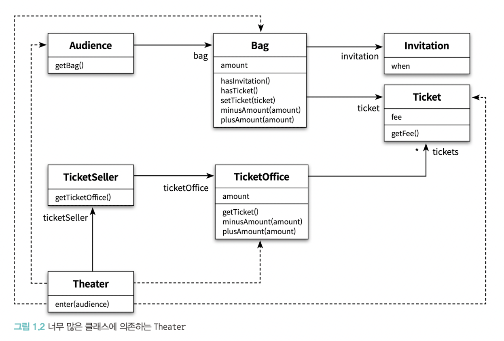

# 오브젝트

# ch1. 객체 설계(p7-20)

로버트 마틴은 소프트웨어 모듈이 가져야 하는 세 가지 기능에 관해 설명함
<br>(모듈이란 크기와 상관없이 클래스나 패키지, 라이브러리와 같이 프로그램을 구성하는 임의의 요소)
1. 제대로 실행되어야 함
2. 변경이 쉬워야 함
3. 코드를 읽고 이해하기 쉬워야 함

## 티켓 판매 애플리케이션 구현하기
### 변경 이전 설계


### 변경 이전 Theater의 enter메서드
```java
public class Theater {
    private TicketSeller ticketSeller;

    public void enter(Audience audience) {
        if (audience.getBag().hasInvitation()) {
            Ticket ticket = ticketSeller.getTicketOffice().getTicket();
            audience.getBag().setTicket(ticket);
        } else {
            Ticket ticket = ticketSeller.getTicketOffice().getTicket();
            audience.getBag().minusAmount(ticket.getFee());
            ticketSeller.getTicketOffice().plusAmount(ticket.getFee());
            audience.getBag().setTicket(ticket);
        }
    }
}
```
### 문제1. 읽고 이해하기 힘듬
위 코드의 문제점은 우선 읽고 이해하기가 힘들다는 것이다.
티켓판매원에게 티켓오피스를 받고, 티켓오피스에서 티켓을 받고...
모든것들이 수동적으로 동작을 한다. 이런 수동적인 코드는 우리의 상식에 많이 어긋나기 때문에 이해하기가 어렵다.
이해하기 어려운 두번째 이유는 세부적인 내용을 모두 기억하고 있어야 하기 때문이다.
ticketSeller가 ticketOffice를 가지고 있고, ticketOffice에 ticket이 있다는 사실을 알아야 비로소 위의 코드를 이해할 수 있다.

### 문제2. 변경에 취약함
객체 사이의 의존성이 높아 변경에 취약하다.
Theater클래스는 audience, ticketSeller와 여러 클래스에 의존성이 높다.
만약 audience가 더 이상 가방을 가지지 않게 변하면?
theater의 enter메서드도 이에 따라 변해야 한다.

## 설계 개선하기
### 자율성을 높이자
enter메서드의 내용을 우리는 ticketSeller의 sellTo라는 메서드로 옮길 수 있다.
```java
public class Theater {
    private TicketSeller ticketSeller;

    public void enter(Audience audience) {
        ticketSeller.sellTo(audience);
    }
}

public class TicketSeller {
    private TicketOffice ticketOffice;

    public void sellTo(Audience audience) {
        if (audience.getBag().hasInvitation()) {
            Ticket ticket = ticketSeller.getTicketOffice().getTicket();
            audience.getBag().setTicket(ticket);
        } else {
            Ticket ticket = ticketSeller.getTicketOffice().getTicket();
            audience.getBag().minusAmount(ticket.getFee());
            ticketSeller.getTicketOffice().plusAmount(ticket.getFee());
            audience.getBag().setTicket(ticket);
        }
    }
}
```
또한 이렇게 코드를 바꾸면서 ticketOffice는 이제 ticketSeller내부에서만 접근할 수 있게 되었다.
이제 ticketSeller는 ticketOffice에서 티켓을 꺼내거나 판매 요금을 적립하는 일을 스스로 수행할 수 밖게 없다.
이렇게 개념적이나 물리적으로 객체 내부의 세부적인 사항을 감추는 것을 캡슐화(encapsulation)라 한다.