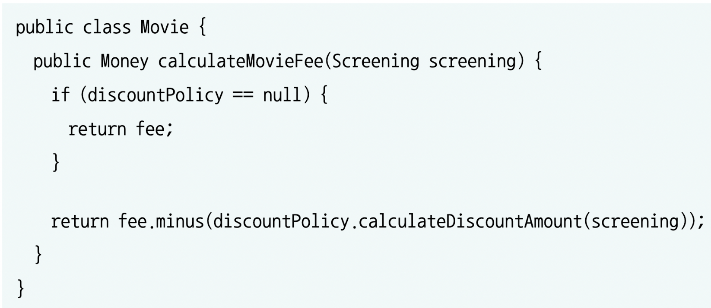

# 오브젝트

# ch2. 객체지향 프로그래밍(p37-67)

- 객체지향은 객체를 지향하는것
- 객체지향 패러다임으로의 전환은 클래스가 아닌 객체에 초점을 맞출 때에만 얻을 수 있음
    1. 어떤 클래스가 필요한지를 고민하기 전에 어떤 객체들이 필요한지 고민해라.
        - 클래스는 공통적인 상태와 행동을 공유하는 객체들을 추상화한 것
        - 따라서 클래스의 윤곽을 잡기 위해서는 어떤 객체들이 어떤 상태와 행동을 가지는지 먼저 결정해야 함
    2. 객체를 독립적인 존재가 아닌 기능을 구현하기 위해 협력하는 공동체의 일원으로 봐야 함
        - 객체들의 모양과 윤곽이 잡히면 공통된 특성과 상태를 가진 객체들을 타입으로 분류하고 이 타입을 기반으로 클래스를 구현해라.
- 도메인: 문제를 해결하기 위해 사용자가 프로그램을 사용하는 분야

## 영화예매 시스템

## 자율적인 객체
- 객체는 상태(state)와 행동(behavior)를 함께 가지는 복합적인 존재
    - 데이터와 기능을 객체 내부로 함께 묶는 것을 캡슐화라고 함
- 객체는 스스로 판단하고 행동하는 자율적인 존재
- 객체 내부를 접근 제어 함으로써 객체를 자율적인 존재로 만들 수 있음
- 캡슐화와 접근 제어는 객체를 두 부분으로 나눔
    - 퍼블릭 인터페이스(public interface): 외부에서 접근 가능한 부분
    - 구현(implementation): 외부에서 접근 불가능 하고 오직 내부에서만 접근 가능한 부분

## 프로그래머의 자유
- 프로그래머의 역할을 1. 클래스 작성자(class creator)와 클라이언트 프로그래머(client programmer)로 구분하는 것이 유용함

## 다형성과 추상화
- 메시지와 메서드는 다른 개념
- 다형성을 구현하는 방법은 매우 다양함
- 메시지에 응답하기 위해 실행될 메서드를 컴파일 시점이 아닌 실행 시점에 결정한다는 공통점이 있다.
- 상속은 구현 상속(implementation inheritance)와 인터페이스 상속(interface inheritance)가 있음
    - 구현 상속: 순수하게 코드를 재사용하기 위한 목적으로 상속을 사용하는 것
    - 인터페이스 상속: 다형적인 협력을 위해 부모 클래스와 자식 클래스가 인터페이스를 공유할 수 있도록 상속을 이용하는 것
- **상속은 인터페이스 상속을 위해 사용해야 함**
- 추상화를 사용할 경우 두가지 장점이 있음
    - 1) 추상화의 계층만 따로 떼어 놓고 살펴보면 요구사항의 정책을 높은 수준에서 서술할 수 있음
    - 2) 추상화를 이용하면 설계가 좀 더 유연해짐
- **책임의 위치를 결정하기 위해 조건문을 사용하는 것은 협력의 설계 측면에서 대부분의 경우 좋지 않은 선택**
   
이번 챕터에선 추상화를 통해 여러가지 할인 정책이나 할인 정책 조건을 표현했네요. 추상화를 사용했을때 장점으로 “추상화의 계층만 따로 떼어 놓고 살펴보면 요구사항의 정책을 높은 수준에서 서술할 수 있다”고 설명합니다. 이로인해 “영화 예매 요금은 하나의 할인 정책과 다수의 할인 조건을 이용해 계산할 수 있다”라고 간결하게 프로그램의 협력방식을 설명할 수 있게 되었습니다.
할인 정책이 없는 ‘스타워즈’를 아래와 같은 코드로 처리하면 일관성 있던 협력 방식에 예외가 생기게 됩니다.

책에서는 “책임의 위치를 결정하기 위해 조건문을 사용하는 것은 협력의 설계 측면에서 대부분의 경우 좋지 않은 선택이다”라고 합니다.
이 부분을 보고 저는 “왜 if문을 지양해야 하는지”에 대해 생각하게 되었습니다. 
미션의 요구사항인 ‘else문을 쓰지 마라’라던지 리뷰로 받은 ‘if문을 리팩터링 해보면 어떨까요?’가 단순히 가독성과 유연성이 떨어지기 때문이라고 생각했었는데, 그 속에 “일관성 있던 협력 방식이 깨지게 된다”라는 이유도 있다는걸 알게되었습니다.
‘if문을 지양해라’ 라는 요구사항이 무엇 때문인지 고민해 볼 필요가 있을 것 같습니다.
