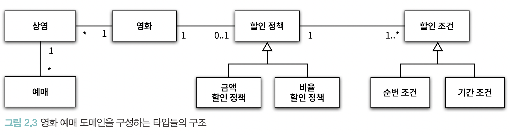

# 오브젝트

# ch2. 객체지향 프로그래밍(p37-46)

- 객체지향은 객체를 지향하는것
- 객체지향 패러다임으로의 전환은 클래스가 아닌 객체에 초점을 맞출 때에만 얻을 수 있음
    1. 어떤 클래스가 필요한지를 고민하기 전에 어떤 객체들이 필요한지 고민해라.
        - 클래스는 공통적인 상태와 행동을 공유하는 객체들을 추상화한 것
        - 따라서 클래스의 윤곽을 잡기 위해서는 어떤 객체들이 어떤 상태와 행동을 가지는지 먼저 결정해야 함
    2. 객체를 독립적인 존재가 아닌 기능을 구현하기 위해 협력하는 공동체의 일원으로 봐야 함
        - 객체들의 모양과 윤곽이 잡히면 공통된 특성과 상태를 가진 객체들을 타입으로 분류하고 이 타입을 기반으로 클래스를 구현해라.
- 도메인: 문제를 해결하기 위해 사용자가 프로그램을 사용하는 분야

## 영화예매 시스템

## 자율적인 객체
- 객체는 상태(state)와 행동(behavior)를 함께 가지는 복합적인 존재
    - 데이터와 기능을 객체 내부로 함께 묶는 것을 캡슐화라고 함
- 객체는 스스로 판단하고 행동하는 자율적인 존재
- 객체 내부를 접근 제어 함으로써 객체를 자율적인 존재로 만들 수 있음
- 캡슐화와 접근 제어는 객체를 두 부분으로 나눔
    - 퍼블릭 인터페이스(public interface): 외부에서 접근 가능한 부분
    - 구현(implementation): 외부에서 접근 불가능 하고 오직 내부에서만 접근 가능한 부분

## 프로그래머의 자유
- 프로그래머의 역할을 1. 클래스 작성자(class creator)와 클라이언트 프로그래머(client programmer)로 구분하는 것이 유용함
