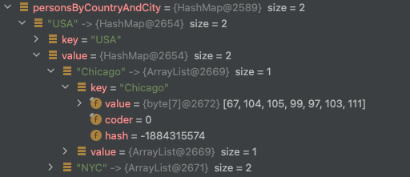
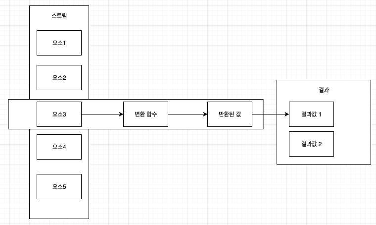

# 모던 자바 인 액션 P181-P196(2022.02.28)
- - -
## 기본형 특화 스트림
  자바 8에서는 세 가지 기본형 특화 스트림(primitive stream specialization)을 사용해 스트림 API 사용으로 인한 박싱 비용을 피할 수 있다. 기본형 특화 스트림의 종류는 다음과 같다.

    1. int 요소에 특화된 IntStream

    2. double 요소에 특화된 doubleStream

    3. Long 요소에 특화된 LongStream

  각 인터페이스는 숫자 관련 리듀싱 연산 수행 메서드를 제공한다. 예를 들어 IntStream의 일부를 보면 다음과 같은 메서드가 존재한다.
```java
/**
 * Returns the sum of elements in this stream.  This is a special case
 * of a <a href="package-summary.html#Reduction">reduction</a>
 * and is equivalent to:
 * <pre>{@code
 *     return reduce(0, Integer::sum);
 * }</pre>
 *
 * <p>This is a <a href="package-summary.html#StreamOps">terminal
 * operation</a>.
 *
 * @return the sum of elements in this stream
 */
int sum();
 
/**
 * Returns an {@code OptionalInt} describing the minimum element of this
 * stream, or an empty optional if this stream is empty.  This is a special
 * case of a <a href="package-summary.html#Reduction">reduction</a>
 * and is equivalent to:
 * <pre>{@code
 *     return reduce(Integer::min);
 * }</pre>
 *
 * <p>This is a <a href="package-summary.html#StreamOps">terminal operation</a>.
 *
 * @return an {@code OptionalInt} containing the minimum element of this
 * stream, or an empty {@code OptionalInt} if the stream is empty
 */
OptionalInt min();
 
/**
 * Returns an {@code OptionalInt} describing the maximum element of this
 * stream, or an empty optional if this stream is empty.  This is a special
 * case of a <a href="package-summary.html#Reduction">reduction</a>
 * and is equivalent to:
 * <pre>{@code
 *     return reduce(Integer::max);
 * }</pre>
 *
 * <p>This is a <a href="package-summary.html#StreamOps">terminal
 * operation</a>.
 *
 * @return an {@code OptionalInt} containing the maximum element of this
 * stream, or an empty {@code OptionalInt} if the stream is empty
 */
OptionalInt max();

```
특화 스트림은 오직 박싱과정에서 일어나는 효율성과 관젼있고 스트림에 추가 기능을 제공하지 않는다.
### 숫자 스트림으로 매핑
 스트림을 특화 스트림을 만들 때는 mapToInt, mapToDouble, mapToLong을 가장 많이 상요하며 이들은 Stream<T> 대신 특화된 스트림을 반환한다. 따라서 다음과 같이 바로 합을 구할 수 있다.
```java
int calories = menu.stream() // Stream<Dish>
    .mapToInt(Dish::getCalories) // IntStream
    .sum();
```
  만약 스트림이 비어 있으면 sum은 0을 반환한다.
### 객체 스트림으로 복원
특화된 스트림을 일반 스트림으로 복원하고 싶다면 boxed()를 사용하면 된다. IntStream의 boxed의 경우 다음과 같다.
```java
/**
 * Returns a {@code Stream} consisting of the elements of this stream,
 * each boxed to an {@code Integer}.
 *
 * <p>This is an <a href="package-summary.html#StreamOps">intermediate
 * operation</a>.
 *
 * @return a {@code Stream} consistent of the elements of this stream,
 * each boxed to an {@code Integer}
 */
Stream<Integer> boxed();
```
### 기본값: OptionalInt
특화된 스트림을 사용해 최대값을 찾을 때도 sum 메서드와 같이 스트림이 없을 때 0을 반환한다면, 0으로 인해 잘못된 결과다 도출될 수 있다. 따라서 이런 연산의 경우 Optional의 기본형 특화 스트림 버전인 OptionalInt, OptionalLong, OptionalDouble을 제공한다. 이를 통해 다음과 같이 값이 없을 경우의 반환값을 지정할 수 있다.

  IntStream의 경우 reduce, min, max, findFirst, findAny의 반환값이 OptionalInt이다.
```java
int maxCalories = menu.stream()
    .mapToInt(Dish::getCalories)
    .max()
    .orElse(0)l // 값이 없으면 0을 반환.
```
### 숫자 범위
IntStream과 LongStream은 rage와 rangeClosed 정적 메서드를 제공하고 이를 통해 특정 숫자 범위를 활용한 연산을 할 수 있다. 이 두 연산은 첫 번째 인자로 시작값을, 두 번째 인자로 종료값을 받는다는 공통점이 있다. 하지만 range는 시작값과 종료값이 결과에 포함되지 않는 반면((start, end)) rangeClosed는 시작값과 종료값이 결과에 포함된다([start, end]).
```java
IntStream.rangeClosed(1, 100) // [1, 100]
    .filter(number -> number % 2 == 0); // 1 <= number <= 100을 만족하는 짝수
 
 
IntStream.range(1, 100) // (1, 100)
    .filter(number -> number % 2 == 0); // 1 < number < 100을 만족하는 짝수
```
- - -
## 스트림 만들기
지금까지 stream 메서드를 활용해 컬렉션에서 스트림을 얻는 방법과 숫자 범위를 사용해 스트림을 얻는 방법을 살펴 보았다. 이제 배열, 파일 등을 활용해 스트림을 만드는 방법을 살펴보자.
### 값으로 스트림 만들기
  임의의 수를 인수로 받는 정적 메서드 Stream.of를 사용해 스트림을 만들 수 있다.
```java
Stream<String> stream = Stream.of("a", "b", "c");
```
### null이 될 수 있는 객체로 스트림 만들기
자바 9에서 추가된 ofNullable 덕분에 더이상 null이 될 수 있는 객체를 스트림으로 만들 때 명시적으로 확인할 필요가 없어졌다.
```java
// 자바 8까지는 null을 명시적으로 확인해야 했다.
Stream<String> Stream = homeValue == null ? Stream.empty() : Stream.of(value);
 
// 자바 9부터는 ofNullable를 사용해 명시적 확인을 없앨 수 있다.
Stream<String> Stream = Stream.ofNullable(value);
```
이게 가능한 이유는 ofNullable가 내부적으로 전달받은 인자의 null 여부를 체크해 null이면 Stream.empty()를 호출하기 때문이다.
```java
// ofNullable 로직 
public static<T> Stream<T> ofNullable(T t) {
    return t == null ? Stream.empty()
        : StreamSupport.stream(new Streams.StreamBuilderImpl<>(t), false);
}
```
### 배열로 스트림 반들기
  배열을 인수로 받는 정적 메서드 Arrays.stream을 사용하면 배열을 스트림으로 만들 수 있다.
```java
int[] numbers = {1, 2, 3, 4};
Arrays.Stream(numbers) // IntStream
```
### 파일로 스트림 만들기
파일을 처리하는 등의 I/O 연산에 상요하는 자바의 NIO API(비블록 I/O)는 스트림 API를 활용할 수 있게 업데이트 되었다. 예를 들어 java.nio.file.Files의 File.lines는 주어진 파일의 행 스트림을 문자열로 반환한다. 따라서 다음과 같은 연산을 할 수 있다.
```java
long uniqueWords = 0;
try (Stream<String> lines = Files.lines(Paths.get("data.txt"), Charset.defaultCharset())) {
    uniqueWords = lines.flatMap(line -> Arrays.stream(line.split(" ")))
        .distinct()
        .count();
} catch (IOException e) {
    ...
}
```
- - -
## 함수로 무한 스트림 만들기
스트림 API는 크기가 고정되지 않은 스트림을 만드는 무한 스트림(inifinite stream) 기능을 제공한다. 무한 스트림은 Stream.iterate와 Stream.generate를 통해 생성할 수 있다. 
이런 무한 스트림을 unbounded stream이라 한다.
### iterate 메서드
 iterate는 인자로 초기값과 람드를 받아 새로운 값을 끊임없이 생성한다. 기본적으로 iterate는 기존 결과에 의존해 순차적으로 연산을 수행한다. 통상적으로 일련의 연속된 값을 생성하기 위해 iterate를 사용하며 limit을 통해 갯수를 제한한다.
```java
Stream.iterate(0, n -> n + 2)
    .limit(10)
    .forEach(System.out::println);
```
  자바 9부터는 iterate가 predicate를 제공한다. 따라서 중단 조건을 다음과 같이 명시할 수 있다.
```java
Stream.iterate(0, n -> n < 100 , n -> n + 2) // n >= 100이면 중단
    .forEach(System.out::println);
```
  또는 스트림 쇼트서킷을 지원하는 takeWhile을 사용해 종료 조건을 명시할 수 있다.
```java
Stream.iterate(0, n -> n + 2)
    .takeWhille(n -> n < 100)
    .forEach(System.out::println);
```
### generate 메서드
  generate는 생산된 각 값을 연속적으로 계산하지 않는다. generate는 Supplier<T>를 인수로 받아 새로운 값을 생성한다.
```java
Stream.generate(Math::random)
    .limit(5)
    .forEach(System.out::println);
 
```
- - -

# 모던 자바 인 액션 P197 ~ P209 (2022.03.02)
중간 연산은 파이프라인을 구성해 스트림의 요소를 소비(consume)하지 않는다. 반면 최종 연산은 스트림의 요소를 소비해 최종 결과를 도출한다. 최종 연산은 스트림 파이프라인을 최적화해 계산 과정을 짧게 생략하기도 한다.
- - -
## 컬렉터란 무엇인가?
최종 연산인 collect 메서드는 Collector 인터페이스의 구현을 전달받아 스트림의 요소를 어떤 식으로 도출할지 지정한다. 예를 들어 .collect(Collectors.toList())에서 toList는 스트림을 리스트로 변환해 Collector를 반환한다.
```java
// Stream<T> interface 의 collect
<R, A> R collect(Collector<? super T, A, R> collector);
 
// Stream<T>를 implement한 ReferencePiepline의 collect
@Override
public final <R, A> R collect(Collector<? super P_OUT, A, R> collector) {
    A container;
    if (isParallel()
            && (collector.characteristics().contains(Collector.Characteristics.CONCURRENT))
            && (!isOrdered() || collector.characteristics().contains(Collector.Characteristics.UNORDERED))) {
        container = collector.supplier().get();
        BiConsumer<A, ? super P_OUT> accumulator = collector.accumulator();
        forEach(u -> accumulator.accept(container, u));
    }
    else {
        container = evaluate(ReduceOps.makeRef(collector));
    }
    return collector.characteristics().contains(Collector.Characteristics.IDENTITY_FINISH)
           ? (R) container
           : collector.finisher().apply(container);
}
 
// Collectors의 toList 메서드
public static <T> Collector<T, ?, List<T>> toList() {
    return new CollectorImpl<>((Supplier<List<T>>) ArrayList::new, List::add,
        (left, right) -> { left.addAll(right); return left; }, CH_ID);
}

```
콜렉터는 groupingBy 메서드를 제공하기 때문에 이를 통해 데이털르 다수준(multilevel)으로 그룹화할 수 있다. 
예컨대 two level grouping을 다음과 같이 수행할 수 있다.
```java
final Map<String, Map<String, List<Person>>> personsByCountryAndCity = persons.stream().collect(
    groupingBy(Person::getCountry,
        groupingBy(Person::getCity)
    )
);
```


이런 multilevel gourping에서 명령형과 선언형 프로그래밍의 차이가 극명이 드러난다. 
명령형은 이런 동작을 하기 위해서 다중 루프와 조건을 사용해야 하는 반면 함수형 프로그래밍은 필요한 컬렉털르 쉽게 추가할 수 있다.
### 고급 리듀싱 기능을 수행하는 컬렉터
  스트림에서 collect를 호출하면 스트림의 요소에(컬렉터로 파라미터화된) 리듀싱 연산이 수행된다. 
collect에서는 리듀싱 연산을 이용해 스트림의 각 요소를 방문하면서 컬렉터가 작업을 처리한다.

### 미리 정의된 컬렉터
Collectors 클래스에서 제공하는 팩토리 메서드를 살펴보자. Collectors는 크게 3가지 메서드를 제공한다.

    1. 스트림 요소를 하나의 값으로 리듀스하고 요약

    2. 요소 그룹화

    3. 요소 분할
- - -
## 리듀싱과 요약
 Collector 팩토리 클래스로 만든 컬렉터 인스턴스로 어떤 일을 할 수 있는지 보자.
### 갯수 카운트
counting 메서드를 사용해 팩토리 메서드가 반환하는 컬렉터의 갯수를 계산할 수 있다.
```java
long dishes = menu.stream()
    .collect(Collectors.counting());
 
// 또는 다음과 같이 생략할 수 있다.
long dishes = menu.stream().count();
 
```
### 스트림에서 최댓값과 최솟값 검색
 Collector.maxBy, Collector.minBy를 사용하면 스트림의 최댓값과 최솟값을 계산할 수 있다.
```java
Comparator<Dish> dishCaloriesComparator = 
    Comparator.comparingInt(Dish::getCalories);
 
// menu가 비어 있다면 값을 반환하지 않으므로
// Optional을 반환한다.
Optional<Dish> mostCaloriesDish = menu.stream()
        .collect(maxBy(dishCaloriesComparator)); // maxBy인자로 Comparator를 사용
```
### 요약 연산
 summingInt는 객체를 int로 매핑하는 함수를 인수로 받고 객체를 int로 매핑한 컬렉터를 반환한다. 
그리고 summingInt가 collect 메서드로 전달되면 요약 작접을 수행한다.
```java
int totalCalories = menu.stream()
    .collect(summingInt(Dish::getCalories));
```
이런 합을 구하는 summing은 summingLong, summingDouble 메서드 역시 존재한다.
  평균을 구하고 싶다면 averagingInt, averagingLong, averagingDouble을 사용하면 된다.
  만약 하나의 요약 연산 결과가 아닌 다수의 요약 연산 결과를 얻고 싶다면 summarizingInt가 반환하는 컬렉터를 사용하면 된다.
```java
IntSummaryStatistics menuStatistics = menu.stream()
    .collect(summarizingInt(Dish::getCalories));
 
// IntSummaryStatistics를 통해 평균, 갯수, 최소, 최대, 합을 얻을 수 있다
// IntSummaryStatistics의 일부:
public class IntSummaryStatistics implements IntConsumer {
    ...
 
    public final long getCount() {
        return count;
    }
 
    public final long getSum() {
        return sum;
    }
 
    public final int getMin() {
        return min;
    }
 
    public final int getMax() {
        return max;
    }
    
    public final double getAverage() {
        return getCount() > 0 ? (double) getSum() / getCount() : 0.0d;
    }
    ...
}
```
### 문자열 연결
 joining 메서드를 사용하면 스트림의 각 객체에 toString 메서드를 호출해 추출한 모든 문자열을 하나의 문자열로 연결해 반환한다. joining 메서드는 내부적으로 StringBuilder를 이용해 문자열을 하나로 만든다.
```java
String shortMenu = menu.stream()
    .map(Dish::getName)
    .collect(joining());
```
### 범용 리듀싱 요약 연산
위에서 서술한 컬렉터는 reducing 팩토리 메서드로 정의할 수 있다. 
그럼에도 위에서 처럼 특화된 컬렉터를 사용한 이유는 프로그래밍적 편의성 때문이다(가독성이 높아지는 등). 
예를 들어 같은 연산을 리듀싱을 사용하면 다음과 같이 가독성이 떨어진다.
```java
// 컬랙터 사용
int totalCalories = menu.stream()
    .collect(summingInt(Dish::getCalories));
 
// 리듀싱 사용 1
// reducing(스트림 인수가 없을 때 반환값, 변환 함수, BinaryOperator)
int totalCalories = menu.stream()
    .collect(reducing(0, Dish::getCalories, (i, j) -> i + j));
 
// 리듀싱 사용 2
// 인자로 하나만 받는 리듀싱은
// reducing(스트림의 시작 요소, 항등 함수, BinaryOperator)
// 와 같이 된다.
// 따라서 인지가 없을 수 있으므로 Optional 반환.
Optional<Dish> totalCalorieDish = menu.stream()
    .collect(reducing((i, j) -> i + j));
```
### 자신 상황에 맞는 최적의 해법 선택
  위에서 볼 수 있듯 함수형 프로그래밍에서는 하나의 연산을 다양한 방법으로 해결할 수 있다. 
또 한 스트림 인터페이스에서 직접 제공하는 메서드를 이용하는 것에 비해 컬렉터를 이용하는 코드가 더 복잡하다.
 대신 재상용성과 커스터마이즈 가능성을 제공하는 높은 수준의 추상화와 일반화를 얻을 수 있다. 
  문제를 해결할 수 있는 다양한 해결 방법을 확인한 다음에 가장 일반적으로 문제에 특화된 해결책을 고르는 것이 좋다.
- - -
# 이펙티브 자바 item11(P67 - 72) item46(P277 - 283) (2022.03.03)
# item 11. equals를 재정의하려거든 hashCode도 재정의하라
equals를 재정의한 클래스 모두에서 hashCode도 재정의해야 한다. 그렇지 않으면 클래스 인스턴스를 HashMap 같은 컬랙션의 원소로 사용할 때 문제가 발생한다.

  자바 레퍼런스의 Object에 있는 hashCode의 명세를 보면 다음과 같이 hashCode를 설명한다.

    1. equals 비교에 상요되는 정보가 변경되지 않았다면, 애플리케이션이 실행되는 동한 그 객체의 hashCode 메서드는 호출 횟수와

      무관하게 같은 값을 반환해야 한다. 단, 애플리케이션을 재실행 한다면 값이 달라져도 상관없다.

    2. equals(Object)가 두 객체를 같다고 판단하면, 두 객체의 hashCode는 똑같은 값을 반환해야 한다

       (논리적으로 같은 객체는 같은 해시코드를 반환해야 한다).

    3. equals(Object)가 두 객체를 다르다 판단했어도, 두 객체의 hashCode가 서로 다른 값을 반환할 필요가 없다.

      단, 다른 객체에 대해 다른 값을 반환하면 해시테이블의 성능이 좋아진다.

  equals는 물리적으로 다른 두 객체를 논리적으로 같다 할 수 있지만 Object의 기본 hashCOde 메서드는 이 둘이 전혀 다르다 판단해 규약과 달리 서로 
다른 값을 반환한다.

  좋은 해시 함수는 서로 다른 인스턴스에 다른 해시코드를 반환해야 한다. 이상적인 해시 함수는 서로 다른 인스턴스들을 32비트 정수 범위에 균일하게 분배해야 한다.

  좋은 hashCode를 작성하는 방법은 다음과 같다.

    1. int 변수 result를 선언할 후 값 c로 초기화한다.

        - 이때 c는 해당 객체의 첫번째 핵심 필드를 단계 2.1 방식으로 계산한 해시코드다.

        - 핵심 필드는 euqals 비교에 사용되는 필드다.

    2. 해당 객체의 나머지 핵심 필드 f 각각에 대해 다음 작업을 수행한다.

        2.1. 해당 필드의 해시코드 c를 계산한다.

          - 기본타입 필드면 Type.hashCode(f)를 수행한다. Type은 해당 기본 타입의 래퍼 클래스다.

          - 참조 타입 필드면서 해당 크래스의 euqals가 필드의 equals를 재귀적으로 호출한다면, 이 필드의 hashCode를

            재귀적으로 호출한다. 필드값이 null이면 0을 사용한다.

          - 필드가 배열이면 각 핵심 원소를 별도의 필드처럼 다룬다. 배열에 핵심 원소가 하나도 없으면 상수 0을 사용한다.

            모든 원소가 핵심이면 Arrays.hashCode를 사용한다.

       2.2. 2.1에서 계산한 해시코드 c로 result를 갱신한다.(result = 31 * result + c;)

    3. result를 반환한다.

  파생 필드(다른 필드로부터 계산해 낼 수 있는 필드)는 무시해도 된다. 또 한 euqals 연산에 사용되지 않는 필드는 반드시 제외해야 위에서 말한 
"equals(Object)가 두 객체를 같다고 판단하면, 두 객체의 hashCode는 똑같은 값을 반환해야 한다"를 만족할 수 있다.

  단계 2.2의 곱셈은 필드를 곱하는 순서에 따라 다르기 때문에 비슷한 필드가 여러개면 해시 효과를 크게 높여준다. 곱한 숫자가 31인 이유는 31이 홀수면서 
소숴이기 떄문이다. 숫자가 짝수고 오버플로가 발생하면 정보를 잃는다(2를 곱하는 것은 시프트 연산과 같기 때문이다).

  위 방식을 통해 작성한 hashCode의 예시는 다음과 같다.
```java
@Override
public int hashCode() {
    int result = Short.hashCode(areaCode);
    result = 31 * result + Short.hashCode(prefix);
    result = 31 * result + Short.hashCode(lineNum);
    return result;
}
```
 Objects 내에는 임의의 개수만큼 객체를 받아 해시코드를 계산해주는 정적 메서드인 hash를 제공한다. 하지만 이 메서드는 입력 인수를 담기 위한 배열을 만들고, 
기본 타입에 대한 박식, 언박싱을 거쳐야 하기 때문에 느리다. 따라서 성능에 민감하지 않은 상황에서만 사용하자. 이 hash 메서드의 로직은 다음과 같다.
```java
// Objects의 hash
public static int hash(Object... values) {
    return Arrays.hashCode(values);
}
 
// Arrays의 hash
public static int hashCode(Object a[]) {
    if (a == null)
        return 0;
 
    int result = 1;
 
    for (Object element : a)
        result = 31 * result + (element == null ? 0 : element.hashCode());
 
    return result;
}
```
클래스가 불변이고 해시코드를 계산하는 비용이 크면, 매번 새로 계산하기 보다는 캐싱하는 방식을 고려해야 한다. 
이 타입의 객체가 주로 해시의 키로 사용될 것 같다면 인스턴스 생성시 해시코드를 계산해 두어야 한다.

  해시의 키로 사용되지 않는 경우면 hashCode가 처음 불릴 때 지연 초기화를 해도 된다. 하지만 지연 초기화의 경우 그 클래스를 thread-safe하게 만들어야 한다.
 아래의 예시는 지연 초기화를 사용한 hashCode 예시다.
```java
private int hashCode;
 
@Override
public int hashCode() {
    int result = hashCode;
    if (result == 0) {
        result = Short.hashCode(areaCode);
        result = 31 * result + Short.hashCode(prefix);
        result = 31 * result + Short.hashCode(lineNum);
        hashCode = result;
    }
    return result;
}
```
성능을 높이기 위해 해시코드를 계산할 때 핵심 필드를 빼지 말라. 속도가 빨라지긴 하겠지만, 해시 품질이 저하되 해시테이블의 성능을 심각하게 떨어트린다. 

  hashCode가 반환하는 값의 생성 규칙을 API 사용자에게 알리지 말라. 그래야 클라이언트가 이 값에 의지하지 않게 되고, 추후에 계산 방식을 바꿀 수 있다.
- - -
# item 46. 스트림에서는 부작용 없는 함수를 사용하라
스트림 패러다임의 핵심은 계산을 일련의 변환(transformation)으로 재구성하는 것이다. 여기서 각 변환은 가능한 이전 단계의 결과를 받아서 처리하는 
순수 함수여야 한다. 이를 위해서는 스트림 연산에 건네는 함수 객체는 모두 side-effect가 없어야 한다.

  아래의 예시를 보자.
```java
Map<String, Long> freq = new HashMap<>();
try (Stream<String> words = new Scanner(file).tokens()) {
    words.forEach(word -> {
        freq.merge(word.toLowerCase(), 1L, Long::sum);
    })
}
````
이 코드는 스트림을 가장한 반복적 코드다. 위에서 명시했듯 스트림에서 사용하는 함수는 순수 함수여야 한다. 
하지만 위 코드는 freq에 값을 추가하기에 스트림의 이점을 잘 살리지 못했다. 따라서 이런 코드는 단순 반복 코드보다 길고, 가독성이 떨어지고, 유지보수에 좋지 않다. 
이 코드의 모든 연산은 종단 연산에서 발생하는 데, 이때 외부 상태를 수정하는 람다를 실행하면 문제가 발생한다.

  forEach 연산은 대놓고 반복적이라 병렬화 할 수 없으며 종단 연산 중 가장 스트림 답지 않다. 따라서 스트림 연산 결과를 보고할 때만 사용하자.

  forEach를 사용하는 대신 collector를 사용하라. 아래 예시는 위 코드를 collector를 사용해 바꾼 것이다.
```java
Map<String, Long> freq = new HashMap<>();
try (Stream<String> words = new Scanner(file).tokens()) {
    freq = words
        .collect(groupingBy(String::toLowerCase, counting()));
}
```