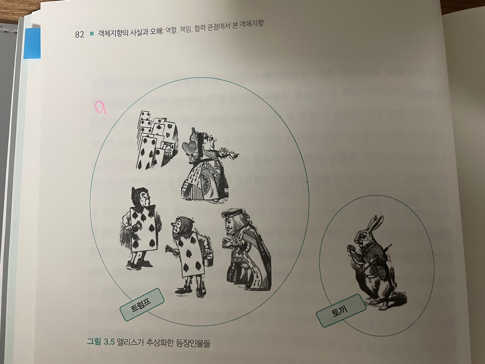
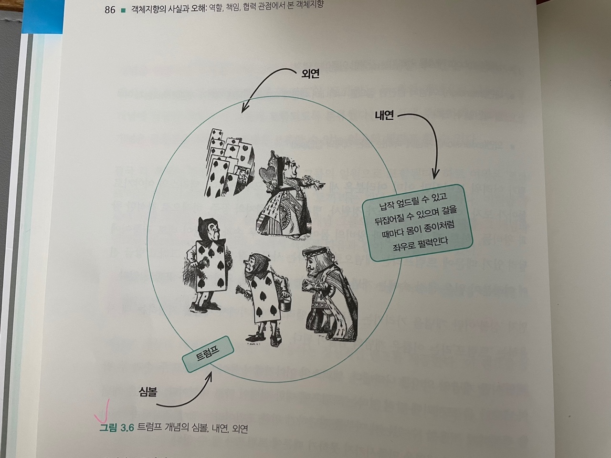
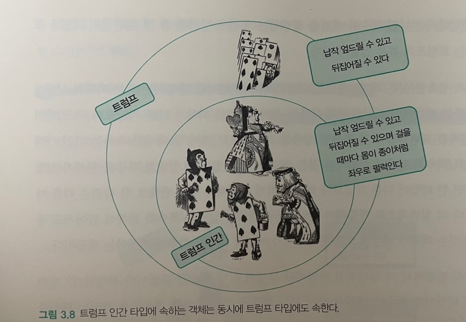
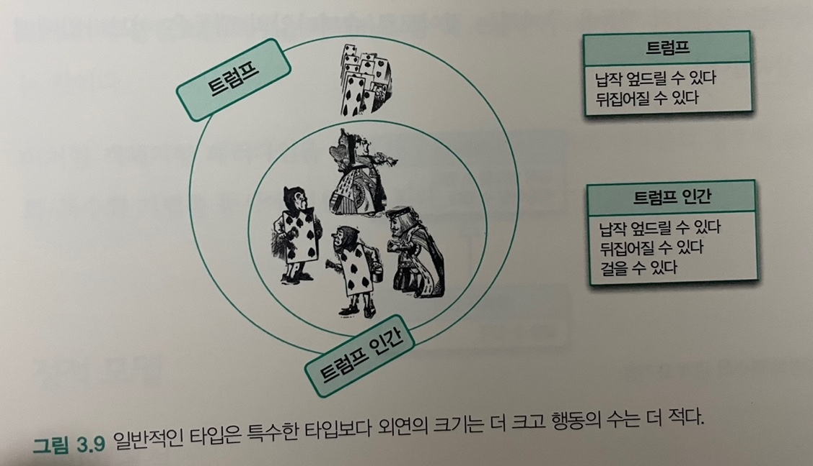
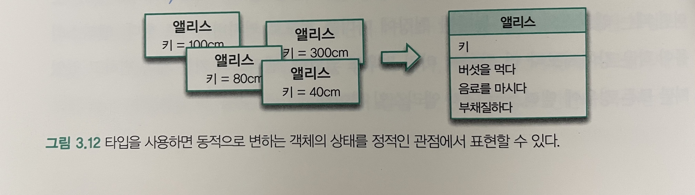

# 03. 타입과 추상화

---

## 1. 추상화를 통한 복잡성 극복

---

현실은 복잡하며 예측 불가능한 혼돈의 덩어리다. 우리가 현실에 존재하는 다양한 현상 및 사물과 상호작용하기 위해서는 우선 현실을 이해해야 한다.
 
문제는 복잡성의 총체인 현실이라는 괴물을 그대로 수용하기에는 인간이 지니고 있는 인지 능력과 저장 공간이 너무나도 보잘것없다는 점이다.
 
따라서 사람들은 본능적으로 이해하기 쉽고 예측 가능한 수준으로 현실을 분해하고 단순화하는 전략을 따른다. 이를 추상화라 한다.

- 추상화란?
  - 어떤 양상, 세부 사항, 구조를 좀 더 명확하게 이해하기 위해 특정 절차나 물체를 의도적으로 생략하거나 감춤으로써 복잡도를 극복하는 방법이다.
  - 복잡성을 다루기 위해 추상화는 두 차원에서 이뤄진다.
    1. 첫 번째 차원은 구체적인 사물들 간의 공통점은 취하고 차이점은 버리는 일반화를 통해 단순하게 만드는 것이다.
    2. 두 번째 차원은 중요한 부분을 강조하기 위해 불필요한 세부 사항을 제거함으로써 단순하게 만드는 것이다.
  - 모든 경우에 추상화의 목적은 복잡성을 이해하기 쉬운 수준으로 단순화 하는 것이라는 점이다.

 
객체지향 패러다임은 객체라는 추상화를 통해 현실의 복잡성을 극복한다. 그리고 객체지향 패러다임을 이용해 유용하고 아름다운 애플리케이션을 개발하기 위한 첫걸음은 추상화의 두 차원을 올바르게 이해하고 적용하는 것이다.
  

## 2. 객체 지향과 추상화

---

### 모두 트럼프일 뿐

위 이미지에 등장하는 객체는 제각기 독특한 모습을 하고 있으며, 독특한 행동 양식을 지니고 있다. 하지만 엘리스는 객체들 중에서 **하얀 토끼를 제외한 모든 객체를 '트럼프'라는 하나의 개념으로 단순화**해서 바라보고 있다. 다시말해, 정원사들, 병사들, 왕자와 공주, 하객으로 참석한 왕과 왕비들, 하트 왕과 하트 여왕의 차이점은 과감하게 무시한 채 **공통점만을 취해 단순화** 해 버렸다.
  

엘리스의 대사 중 **"기껏해야 트럼프에 불과해"**라고 읇조리는 마지막 대사에서 엘리스는 정원에 서있는 다양한 인물들을 계급, 나이, 성격 등의 **차이점은 무시한 채 "트럼프"라는 유사성을 기반으로 추상화해서 바라보고 있는 것**이다.
  

### 그룹으로 나누어 단순화하기

위 이미지의 인물들을 하나씩 살펴보면서 자신이 알고 있는 "트럼프"의 의미에 적합한 인물은 "트럼프" 그룹에 포함하고 "트럼프"라는 의미에 적합하지 않은 인물은 "트럼프" 그룹에서 제외했다.
  

 
결과적으로 엘리스는 정원에 있는 인물들을 두 개의 그룹으로 나눴다. 하나는 트럼프의 그룹이고 또 다른 하나는 토끼의 그룹이다.

 

"트럼프"와 "토끼"라는 **두 개의 렌즈**를 통해 정원을 바라보는 것은 **정원에 내재된 복잡성을 효과적으로 감소**시킨다.
  

### 개념

객체지향 패러다임의 중심에는 구체적이고 실제적인 객체가 존재하지만 수많은 객체들을 개별적인 단위로 취급하기에는 인간이 지닌 인지능력은 턱없이 부족하다. 따라서 사람들은 본능적으로 공통적인 특성을 기준으로 객체를 여러 그룹으로 묶어 동시에 다뤄야 하는 가짓수를 줄임으로써 상황을 단순화하려고 노력한다.
  

이처럼 **공통점을 기반으로 객체들을 묶기 위한 그릇을 개념(concept)**이라고 한다.
  

개념을 이용하면 객체를 여러 그룹으로 분류(classification)할 수 있다.
 

엘리스가 정원에 존재하는 객체를 "트럼프"와 "토끼"라는 두 개의 개념으로 나누고는 두 개념에 적합한 객체가 각 그룹에 포함되도록 분류했다는 사실에 주목하자.
 

결과적으로, **개념은 공통점을 기반으로 객체를 분류할 수 있는 일종의 체**라고 할 수 있다.
 

객체에 어떤 개념을 적용하는 것이 가능해서 **개념 그룹의 일원이 될 때 객체를 그 개념의 인스턴스(instence)**라고 한다.
  

다시말해, 객체란 특정한 개념을 적용할 수 있는 구체적인 사물을 의미한다. 개념이 객체에 적용됐을 때 객체를 개념의 인스턴스라고 한다.
  

### 개념의 세 가지 관점

개념은 특정한 객체가 어떤 그룹에 속할 것인지를 결정한다.
 

즉, 어떤 객체에 어떤 개념이 적용됐다고 할 때는 그 개념이 부가하는 의미를 만족시킴으로써 다른 객체와 함께 해당 개념의 일원이 됐다는 것을 의미한다.
 

일반적으로 객체의 분류 장치로서 개념을 이야기할 때는 아래의 세 가지 관점을 함께 언급한다.

1. **심볼(symbol)**: 개념을 가리키는 간략한 이름이나 명칭
2. **내연(intension)**: 개념의 완전한 정의를 나타내며 내연의 의미를 이용해 객체가 개념에 속하는지 여부를 확인할 수 있다.
3. **외연(extension)**: 개념에 속하는 모든 객체의 집합(set)

 

  

엘리스의 이야기에 트럼프라는 개념의 심볼, 내연, 외연은 다음과 같이 표현할 수 있다.

1. **심볼(symbol)**: 트럼프
2. **내연(intension)**: 몸이 납작하고 두 손과 두 발은 네모 귀퉁이에 달려 있는 등장인물
3. **외연(extension)**: 정원사, 병사, 신하, 왕자와 공주, 하객으로 참석한 왕과 왕비들, 하트 잭, 하트 왕과 하트 여왕

 

개념을 이용해 **공통점을 지닌 객체들을 분류할 수 있다는 아이디어는 객체지향 패러다임이 복잡성을 극복하는 데 사용하는 가장 기본적인 인지 수단**이다.
 
다시 말해, 객체지향의 세계에서 가장 널리 알려진 유명인사가 클래스(class)라는 사실을 감안한다면 분류(classification)라는 개념이 얼마나 중요한지 실감할 수 있을 것이다.
  

### 객체를 분류하기 위한 틀

분류란?

- 특정한 객체를 특정한 개념의 객체 집합에 포함시키거나 포함시키지 않는 작업을 의미한다.
- 객체지향의 가장 중요한 개념중 하나다. 어떤 객체를 어떤 개념으로 분류할지가 객체지향의 품질을 결정한다.

 
객체는 소중하다. 따라서 소중한 **객체를 안전하고 적절한 장소에 보관할 수 있도록 인지능력을 최대한 발휘해 최대한 직관적으로 분류**하자!

  

### 분류는 추상화를 위한 도구다

추상화가 두 가지 차원에서 이뤄진다고 했던 것을 머릿속에 떠올리자.
 
첫 번째 차원은 구체적인 사물 간의 공통점은 취하고 차이점은 버리는 일반화를 통해 단순화하는 것이다.
 
두 번째 차원은 중요한 부분을 강조하기 위해 불필요한 세부 사항을 제거해 단순화하는 것이다.
  

**개념을 통해 객체를 분류하는 과정은 추상화의 두 가지 차원을 모두 사용한다.**
  

## 3. 타입

---

### 타입은 개념이다

타입의 정의는 개념의 정의와 동일하다.
 
따라서 타입이란 우리가 인식하고 있는 다양한 사물이나 객체에 적용할 수 있는 아이디어나 관념을 의미한다. 어떤 객체에 타입을 적용할 수 있을 때 그 객체를 타입의 인스턴스라고 한다. 타입의 인스턴스는 타입을 구성하는 외연인 객체 집합의 일원이 된다.
  

하지만, 타입이 근본적으로 개념과 동일하다고 하더라도 일단 컴퓨터 내부로 들어오는 순간 좀 더 기계적인 의미로 윤색된다. 그리고 기계적인 의미는 종종 개발자들의 머리를 혼란스럽게 만든다.
  

### 데이터 타입

컴퓨터 내부의 타입 시스템의 목적은 데이터가 잘못 사용되지 않도록 제약사항을 부과하는 것이다.
  

타입에는 두 가지 중요한 사실이 있다.

1. 타입은 데이터가 어떻게 사용되느냐에 관한 것이다.
    
   일반적으로 데이터를 이용해 수행할 수 있는 작업을 연산자(operator)라고 한다.
    
   예를 들어 숫자현 데이터에 적용할 수 있는 +, -, \*, / 등의 기호는 산술 연산자의 일종이다.
    
   여기서 중요한 것은 연산자의 종류가 아니라 어떤 데이터에 어떤 연산자를 적용할 수 있느냐가 그 데이터 타입의 타입을 결정한다는 점이다.

2. 타입에 속한 데이터를 메모리에 어떻게 표현하는지는 외부로부터 철저하게 감춰진다.
    
   데이터 타입의 표현은 연산 작업을 수행하기에 가장 효과적인 형태가 선택되며, 개발자는 해당 데이터 타입의 표현 방식을 몰라도 데이터를 사용하는 데 지장이 없다.
    
   따라서 숫자형 데이터에 적용할 수 있는 산술 연산자를 알고 있다면 메모리 내부에 숫자가 어떤 방식으로 저장되는지를 모르더라도 숫자형 데이터를 사용할 수 있다.

 
데이터 타입은 메모리 안에 저장된 데이터의 종류를 분류하는 데 사용하는 메모리 집합에 관한 메타데이터다. 데이터에 대한 분류는 암시적으로 어떤 종류의 연산이 해당 데이터에 대해 수행될 수 있는지를 결정한다.

### 객체와 타입

전통적인 데이터 타입에서 이야기 하는 타입과 객체지향의 타입 사이에 깊은 연관성이 있다.
 
실제로 객체지향 프로그램을 작성할 때 우리는 객체를 일종의 데이터처럼 사용한다. 따라서 객체를 타입에 따라 분류하고 그 타입에 이름을 붙이는 것은 결국 프로그램에서 사용할 새로운 데이터 타입을 선언하는 것과 같다.
  

그렇다면 객체는 데이터 인가?

- 그렇지 않다. 객체를 창조할 때 가장 중요하게 고려해야 하는 것은 객체가 이웃하는 객체와 협력하기 위해 어떤 행동을 해야 할지를 결정하는 것이다.
- 즉, 객체가 협력을 위해 어떤 책임을 지녀야 하는지를 결정하는 것이 객체지향 설계의 핵심이다.

 

따라서 앞에서 데이터 타입에 관해 언급했던 두 가지 조언은 객체의 타입을 이야기할 때도 동일하게 적용된다.

- 첫째, 어떤 객체가 어떤 타입에 속하는지를 결정하는 것은 객체가 수행하는 행동이다.
  - 어떤 객체들이 동일한 행동을 수행할 수 있다면 그 객체들은 동일한 타입으로 분류될 수 있다.
- 둘째, 객체의 내부적인 표현은 외부로부터 철저하게 감춰진다.
  - 객체의 행동을 가장 효과적으로 수행할 수만 있다면 객체 내부의 상태를 어떤 방식으로 표현하더라도 무방하다.

  

### 행동이 우선이다

객체의 타입을 결정하는 것은 객체의 행동뿐이다.
 
객체가 어떤 데이터를 보유하고 있는지는 타입을 결정하는 데 아무런 영향도 미치지 않는다.
  

같은 타입에 속한 객체는 행동만 동일하다면 서로 다른 데이터를 가질 수 있다.

- 여기서 동일한 행동이란 책임을 의미하며, 동일한 책임이란 동일한 메시지 수신을 의미한다.
- 따라서, 동일한 타입에 속한 객체는 내부의 데이터 표현 방식이 다르더라도 동일한 메시지를 수신하고 이를 처리할 수 있다.
- 다만, 내부의 표현 방식이 다르기 때문에 동일한 메시지를 처리하는 방식은 서로 다를 수 밖에 없다.
- 다시 말해, 동일한 메시지를 서로 다른 방식으로 처리하기 위해서는 객체들은 동일한 메시지를 수신할 수 있어야 하기 때문에 다형적인 객체들은 동일한 타입에 속하게 된다.

 

데이터의 내부 표현 방식과 무관하게 행동만이 고려 대상이라는 사실은 외부에 데이터를 감춰야 한다는 것을 의미한다.

- 따라서, 훌륭한 객체지향 설계는 외부에 행동만을 제공하고 데이터는 행동 뒤로 감춰야 한다.
- 이 원칙을 흔히 캡슐화라고 한다.
- 데이터가 캡슐의 벽을 뚫고 객체의 인터페이스를 오염시키는 순간 객체의 분류 체계는 급격히 위험에 노출되고 결과적으로 유연하지 못한 설계를 낳는다.

 

**객체를 결정하는 것은 행동이다.**
 
데이터는 단지 행동을 따를 뿐이다. 이것이 객체를 객체답게 만드는 가장 핵심적이 원칙이다.

## 4. 타입의 계층

---

### 트럼프 계층

  

위 그림을 보면 트럼프는 엘리스 이야기의 트럼프 인간을 포괄하는 좀 더 일반적인 개념이다. 트럼프 인간은 트럼프보다 좀 더 특화된 행동을 하는 특수한 개념이다.
 
이 두 개념 사이의 관계를 일반화/특수화(generalization/specialization)관계라고 한다.

### 일반화/특수화 관계

트럼프와 트럼프 인간의 예에서 알 수 있는 것 처럼 **타입과 타입 사이에는 일반화/특수화 관계가 존재**할 수 있다.
  

일반화와 특수화는 동시에 일어난다.

- 트럼프 인간은 트럼프를 좀 더 특수하게 표현한 것이다.
- 따라서, 트럼프 인간에 속하는 객체는 트럼프에 속하는 객체보다 그 수가 적을 수 밖에 없다.
- 집합의 관점에서 본다면 특수한 개념을 표현하는 트럼프 인간은 좀 더 일반적인 개념을 표현하는 트럼프의 부분 집합이 된다.
    

두 타입간(트럼프/트럼프 인간)에 일반화/특수화 관계가 성립하려면 한 타입(트럼프 인간)이 다른 타입(트럼프)보다 더 특수하게 행동해야 하고 반대로 한 타입(트럼프)은 다른 타입(트럼프 인간)보다 더 일반적으로 행동해야 한다.
  

여기에서 주의해야할 점은 타입의 내연을 의미하는 행동의 가짓수와 외연을 의미하는 집합의 크기는 서로 반대라는 사실이다.
 
일반화/특수화 관계에서 일반적인 타입은 특수한 타입보다 더 적은 수의 행동을 가지지만 더 큰 크기의 외연 집합을 가진다.
 
특수한 타입은 일반적인 타입보다 더 많은 수의 행동을 가지지만 더 적은 크기의 외연 집합을 가진다.

  

### 슈퍼타입과 서브타입

일반화/특수화 관계는 좀 더 일반적인 한 타입과 좀 더 특수한 한 타입 간의 관계다. 이 때 좀 더 **일반적인 타입을 슈퍼 타입(Supertype)**이라고 하고 좀 더 **특수한 타입을 서브 타입(Subtype)**이라고 한다.
  

슈퍼타입과 서브타입에서 중요한 것은 **두 타입 간의 관계가 행동에 의해 결정**된다는 점이다.
 
즉, 어떤 타입이 다른 타입의 서브타입이 되기 위해서는 행위적 호환성을 만족시켜야 한다.
 

일반적으로 서브타입은 슈퍼타입의 행위와 호환되기 때문에 **서브타입은 슈퍼타입을 대체할 수 있어야한다.**
  
이때 서브타입에서는 슈퍼타입과 중복된 행위를 생략할 수 있다.
 

서브타입은 슈퍼타입의 행위에 추가적으로 특수한 자신만의 행동을 추가하는 것이므로 **슈퍼타입의 행동은 서브타입에게 자동으로 상속**된다.

## 5. 정적 모델

---

### 타입의 목적

타입을 왜 사용해야 하는가?

- 타입을 사용하는 이유는 인간의 인지 능력으로는 시간에 따라 동적으로 변하는 객체의 복잡성을 극복하기가 너무 어렵기 때문이다.

 
엘리스 이야기에서 타입은 시간에 따라 동적으로 변하는 엘리스의 상태를 시간과 무관한 정적인 모습으로 다룰수 있게 해준다.
  

  

### 그래서 결국 타입은 추상화다

타입은 추상화다. 타입을 이용하면 객체의 동적인 특성을 추상화할 수 있다.
 
결국 타입은 시간에 따른 객체의 상태 변경이라는 복잡성을 단순화할 수 있는 효과적인 방법인 것이다.

  

### 동적 모델과 정적 모델

동적 모델(dynamic model)

- 실제로 객체가 살아 움직이는 동안 상태가 어떻게 변하고 어떻게 행동하는지를 포착하는 것

정적 모델(Static model)

- 객체가 가질 수 있는 모든 상태와 모든 행동을 시간에 독립적으로 표현하는 것

 

객체지향 어플리케이션을 설계하고 구현하기 위해서는 객체 관점의 동적 모델과 객체를 추상화한 타입 관점의 정적 모델을 적절히 혼용해야 한다.

### 클래스

결론!

- 객체를 분류하는 기준은 타입이며, 타입을 나누는 기준은 객체가 수행하는 행동이다.
- 객체를 분류하기 위해 타입을 결정한 후 프로그래밍 언어를 이용해 타입을 구현할 수 있는 한 가지 방법이 클래스이다.
- 객체지향에서 중요한 것은 동적으로 변하는 객체의 "상태"와 상태를 변경하는 "행위"다. 클래스는 타입을 구현하기 위해 프로그래밍 언어에서 제공하는 구현 메커니즘이라는 사실을 기억하자!
