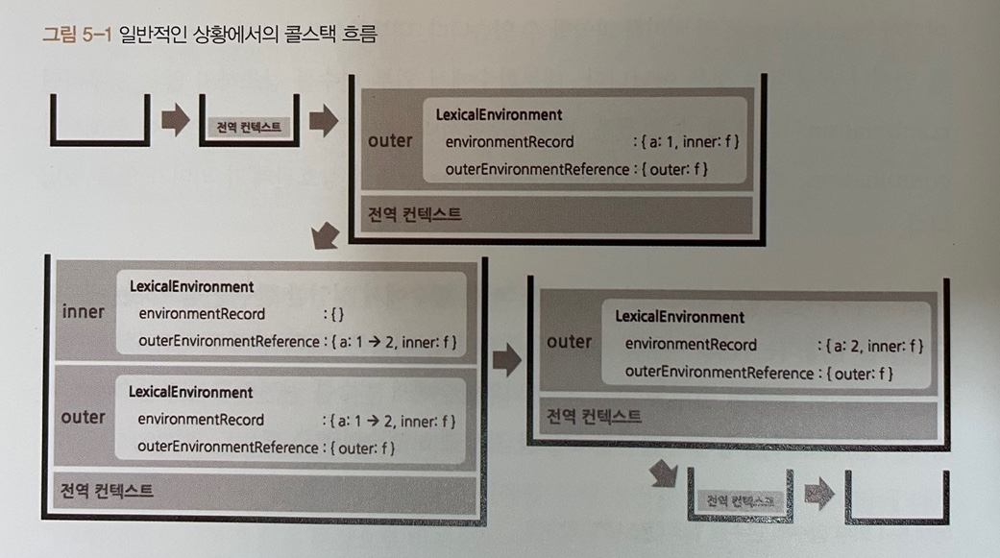
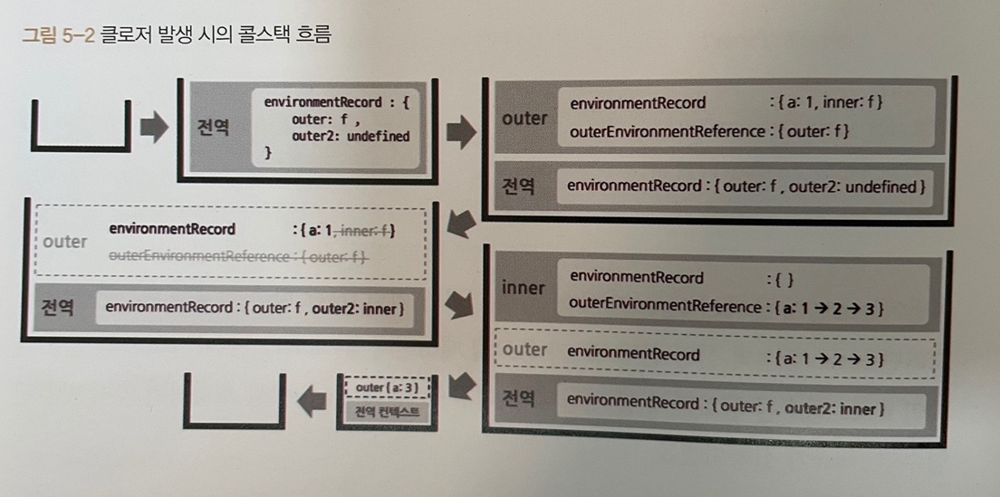

# 05. 클로저(closure)

---

## 01. 클로저의 의미 및 원리 이해

---

MDN에서는 클로저에 대해 "A closure is the combination of a function and the lexical environment within which that function was declared." 라고 소개 되어있습니다.
<br />
직역한다면, "클로저는 함수와 그 함수가 선언될 당시의 lexical enviroment의 상호관계에 따른 현상" 입니다.
<br /><br />

조금 더 이해하기 쉽게 해석한다면,
<br />

**클로저란 어떤 함수 A에서 선언한 변수a를 참조하는 내부함수 B를 외부로 전달할 경우 A의 실행 컨텍스트가 종료된 이후에도 변수 a가 사라지지 않는 현상** 이라고 할 수 있습니다.
<br />

다음은 예제를 보면서 클로저에 대해 알아보도록 하자.

### 클로저가 아닌 예 (일상적인 상황)

---

```javascript
var outer = function () {
  var a = 1;
  var inner = function () {
    console.log(++a);
  };
  inner();
};
outer();
```

<br />
위 예제에서는 outer 함수에서 변수 a를 선언했고, outer의 내부 함수인 inner 함수에서 a의 값을 1만큼 증가시킨 다음 출력한다. inner 함수 내부에서는 a를 선언하지 않았기 때문에 environmentRecord에서 값을 찾이 못하므로 outerEnvironmentReference에 지정된 상위 컨텍스트인 outer의 LexicalEnvironment에 접근해서 다시 a를 찾습니다.
<br />
a를 찾은 후에는 a의 값을 1만큼 증가시킨 2를 출력합니다. 이후 outer 함수의 실행 컨텍스트가 종료되면 LexicalEnvironment에 저장된 식별자들(a, inner)에 대한 참조를 지웁니다.
<br />
그러면 각 주소에 저장돼 있던 값들은 자신을 참조하는 변수가 하나도 없게 되므로 가비지 컬렉터의 수집 대상이 될 것 입니다.

위 예제의 실행 컨텍스트 도식화를 보도록 하겠습니다.
<br />
ThisBinding과 VariableEnvironment는 생략되어 있습니다.

<br />



<br /><br />

### 클로저 예

---

```javascript
var outer = function () {
  var a = 1;
  var inner = function () {
    return ++a;
  };
  return inner;
};
var outer2 = outer();
console.log(outer2()); // 2
console.log(outer2()); // 3
```

위 예제는 outer 함수 내부에서 inner 함수 자체를 반환하고 있습니다.
<br />
그러면 outer 함수의 실행 컨텍스트가 종료될 때 outer2 변수는 outer의 실행 결과인 inner 함수를 참조하게 된다. 이후 outer2를 호출하면 앞서 반환된 inner 함수가 실행됩니다.
<br /><br />

inner 함수의 enviromentRecord에는 수집할 정보가 없고, outerEnviromentReference에는 inner 함수가 선언된 위치의 LexicalEnviroment가 참조 복사된다. 즉, inner 함수는 outer 함수 내부에서 선언됐으므로, outer 함수의 LexicalEnviroment가 담기게 됩니다.
<br />
이제 스코프 체인에 따라 outer에서 선언한 변수 a에 접근해서 1만큼 증가 시킨후 그 값인 2를 반환하고 inner 함수의 실행컨텍스가 종료됩니다. 마지막번째 줄에서 다시 outer2를 호출하면 같은 방식으로 a의 값을 2에서 3으로 1 증가시킨 후 3을 반환하게 됩니다.
<br /><br />

inner 함수 실행 시점에는 outer 함수는 이미 콜스택에서 제거된 상태인데 어떻게 outer 함수의 LexicalEnvironment에 어떻게 접근하는 것일까?
<br />
가비지 컬렉터는 어떤 값을 참조하는 변수가 하나라도 있다면 그 값을 수집 대상에 포함하지 않기 때문에 위와 같이 동작할 수 있는 것입니다.
<br />
다시말해, outer 함수는 실행 종료 시점에 inner 함수를 반환합ㄴ디ㅏ. 외부 함수인 outer의 실행이 종료되었더라도 내부 함수인 inner 함수는 언젠가 outer2를 실행함으로써 호출될 가능성이 열리는 것입니다.
<br />
언젠가 inner 함수의 실행 컨텍스트가 활성화되면 outerEnviromentReference가 outer 함수의 LexicalEnvironment를 필요로 할 것이기 때문에 가비지 컬렉터의 수집대상이 되지 않고 inner 함수가 a 변수에 접근할 수 있게 되는 것입니다.
<br /><br />



<br />

위 이미지는 클로저가 발생할 시 콜스택 흐름을 나타낸 도식화 입니다.

<br /><br />

### Return문이 없는 클로저 예

---

클로저는 반드시 return이 필요한 것은 아닙니다.

```javascript
// setInterval, setTimeout
(function () {
  var a = 0;
  var intervalId = null;
  var inner = function () {
    if (++a >= 10) {
      clearInterval(intervalId);
    }
    console.log(a);
  };

  intervalId = setInterval(inner, 1000);
})();
```

<br />

위 예제는 별도의 외부객체인 window의 메서드(setTimeout, setInterval)에 전달할 콜백 함수 내부의 지역변수를 참조합니다.
<br />

그렇게 때문에 inner 함수는 클로저 입니다.

<br /><br />

```javascript
// eventListener
(function () {
  var count = 0;
  var button = document.querySelector("button");
  button.innerText = "click";
  button.addEventListener("click", function () {
    console.log(++count, "times clicked");
  });
  document.body.appendChild(button);
});
```

<br />

위 예제는 별도의 외부 객체인 DOM의 메서드 addEventListener에 등록할 handler 함수 내부에서 지역변수를 참조합니다.
<br />

따라서 handler 내부함수는 클로저가 됩니다.

<br /><br />

## 02. 클로저와 메모리 관리

---

클로저는 어떤 필요에 의해 의도적으로 함수의 지역변수를 메모리를 소모하도록 함으로써 발생합니다. 그렇다면 그 필요성이 사라진 시점에는 더는 메모리를 소모하지 않게 해주면 메모리를 효율적으로 관리할 수 있습니다.
<br />

### return 에 의한 클로저의 메모리 해제

---

```javascript
var outer = (function () {
  var a = 1;
  var inner = function () {
    return ++a;
  };
  return inner;
})();
console.log(outer()); // 2
console.log(outer()); // 3
outer = null; // outer 식별자의 inner 함수 참조를 끊는다.
```

<br />

### setInterval에 의한 클로저의 메모리 해제

---

```javascript
(function () {
  var a = 0;
  var intervalId = null;
  var inner = function () {
    if (++a > 10) {
      clearInterval(intervalId);
      inner = null; // inner 식별자의 함수 참조를 끊음
    }
    console.log(a);
  };
  interval = setInterval(inner, 1000);
});
```

<br />

### eventListener에 의한 클로저의 메모리 해제

---

```javascript
(function () {
  var count = 0;
  var button = document.createElement("button");
  button.innerText = "click";

  var clickHandler = function () {
    console.log(++count, "times clicked");
    if (count >= 10) {
      button.removeEventListener("click", clickHandler);
      clickHandler = null; // clickHandler 식별자의 함수 참조를 끊음
    }
  };
  button.addEventListener("click", clickHandler);
  document.body.appendChild(button);
});
```

<br /><br />

## 03. 클로저 활용 사례

---

### 5-3-1 콜백 함수 내부에서 외부 데이터를 사용하고자 할 때

---

#### 자바스크립트의 대표적인 콜백함수인 이벤트 리스너에 관한 예시

---

```javascript
var fruits = ["apple", "banana", "peach"];
var $ul = document.createElement("ul");

fruits.forEach(function (fruit) {
  var $li = document.createElement("li");
  $li.innerText = fruit;

  $li.addEventListener("click", function () {
    alert(`your choice is ${fruit}`);
  });

  $ul.appendChild($li);
});

document.body.appendChild($ul);
```

- forEach문 안의 익명의 콜백함수(이후 forEach 콜백함수라 작성) 내부에서 참조하는 외부 변수가 존재하지 않기 때문에 클로저가 아닙니다.

- addEventListener 안의 익명의 콜백함수(이후 이벤트 콜백함수라 작성) 내부에서는 외부 변수 fruit을 참조하고 있기 때문에 클로저 입니다.

forEach 콜백함수는 fruits의 개수만큼 실행되며, 그때마다 새로운 실행 컨텍스트가 활성화 됩니다.

forEach 콜백함수의 실행 종료 여부와는 무관하게 클릭 이벤트에 의해 각 컨텍스트의 이벤트 콜백함수가 실행될 때는 이벤트 콜백함수의 outerEnvironmentReference가 forEach 콜백함수의 LexicalEnvironment를 참조하게 됩니다.

따라서 최소한 이벤트 콜백함수가 참조할 예정인 변수 fruit에 대해서는 forEach 콜백함수가 종료된 후에도 가비지 컬렉터의 대상에서 제외되어 계속 참조가 가능해집니다.

#### 이벤트 콜백함수의 분리

---

```javascript
var alertFruits = function (fruit) {
  alert(`your choice is ${fruit}`);
};

fruits.forEach(function (fruit) {
  var $li = document.createElement("li");
  $li.innerText = fruit;

  $li.addEventListener("click", alertFruits.bind(null, fruit));
  $ul.appendChild($li);
});

document.body.appendChild($ul);
```

이전 예제에서 이벤트 콜백함수가 반복적으로 생성되는 것을 방지하기 위해 이벤트 콜백함수를 공통 함수 alertFruits로 분리 후 bind 첫번째 인자는 null, 두 번째 인자는 fruit을 넘겨주었습니다.

bind를 하지 않고 alertFruits만 넘겨줄 경우 alertFruits의 인자인 fruit에는 event 객체가 담겨 있게 됩니다.

하지만 여기에서 문제는 이벤트 객체가 인자로 넘어오는 순서가 바뀌는 점 및 함수 내부에서의 this가 달라지는 상황을 감안해야합니다.

여기서 고차함수를 활용하면 위 문제를 해결할 수 있다.

#### 고차 함수로 분리

---

```javascript
var fruits = ["a", "b", "c"];

var alertFruitBuilder = function (fruit) {
  return function () {
    alert(`your choice is ${fruit}`);
  };
};

fruits.forEach(function (fruit) {
  var $li = document.createElement("li");
  $li.innerText = fruit;

  $li.addEventListener("click", alertFruitBuilder(fruit));
  $ul.appendChild($li);
});

document.body.appendChild($ul);
```

alertFruitBuilder 함수는 내부에서 다시 익명함수를 return 하는데 이 익명함수가 기존의 alertFruit 함수입니다.

이렇게 고차함수로 작성하게 되면 bind의 문제점을 해결할 수 있고 클로저를 통해 fruit의 변수도 outerEnvironmentReference에 의해 참조할 수 있게 됩니다. 즉 alertFruitBuilder의 실행 결과로 반환된 함수에는 클로저가 존재합니다.

<br /><br />
